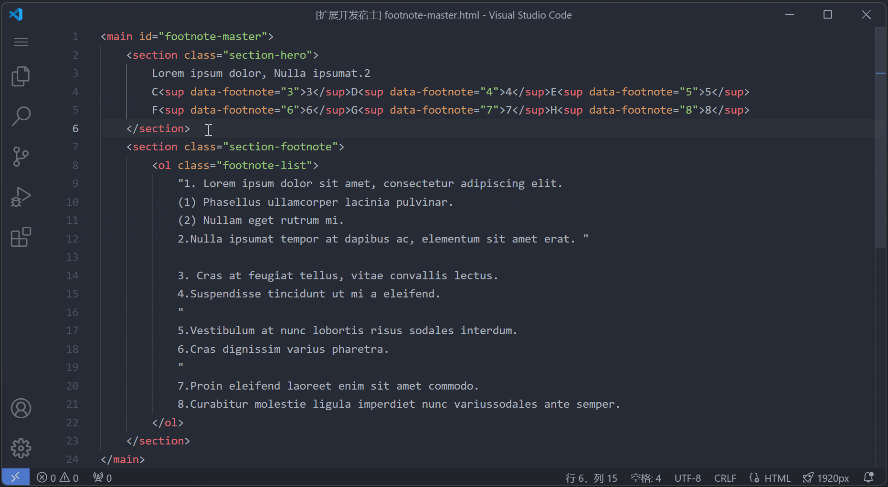

# 脚注大师

提供轻松便捷的脚注操控体验，让文档注释整理事半功倍。

## 特性

- 提供一键生成脚注上标代码功能，简化编写过程，统一代码风格。
- 能够快速地将有序文本转换为规范的脚注列表项，提升开发效率。
- 实现自定义调整脚注序号功能，即便文案频繁更新也能轻松应对。

## 用法

- 生成脚注上标：

  通过使用快捷键 `Alt+S` 或右键菜单选择 `脚注大师 > 生成脚注上标` 运行指令。

  - 未选序号：生成空的上标代码 ``，方便手动输入序号。
  - 选中序号：生成包含选中序号的上标代码 `序号`。

- 生成脚注列表项：

  1. 选中文案文档中的备注列，并将其整个复制到代码编辑器中。
  2. 选中包含脚注的文本行，通过使用快捷键 `Ctrl+Alt+F` 或右键菜单选择 `脚注大师 > 生成脚注列表项` 运行指令。
  3. 完成后，所有匹配的 `序号.脚注文本` 将被转换为 `<li id="footnote-序号">脚注文本</li>`。转换过程中，原文本中的换行将被保留，允许开发者根据需要选择是否移除。此外，脚注大师会自动清除不必要的空行以及因粘贴表格单元格内带文本换行而引入的额外双引号。

- 脚注序号重新排序：

  当文案的脚注部分有增删变动时，需要从变更位置开始，依次调整所有后续脚注的序号。

  1. 通过使用快捷键 `Ctrl+Alt+R` 或右键菜单选择 `脚注大师 > 脚注序号重新排序` 运行指令。
  2. 输入脚注起始序号和排序规则，按回车键执行排序操作。
  3. 完成后，所有匹配的脚注上标和列表项序号都将自动更新。

  - 当执行序号增补操作（排序规则数值大于零）时，脚注大师会在未更新与已更新的脚注列表项之间填充空列表项，以维持序号的连续性，同时便于插入新增文本。
  - 当执行序号删减操作（排序规则数值小于零）时，脚注大师会将被删减的脚注上标及列表项进行注释，有助于对比和后续的删除操作。
